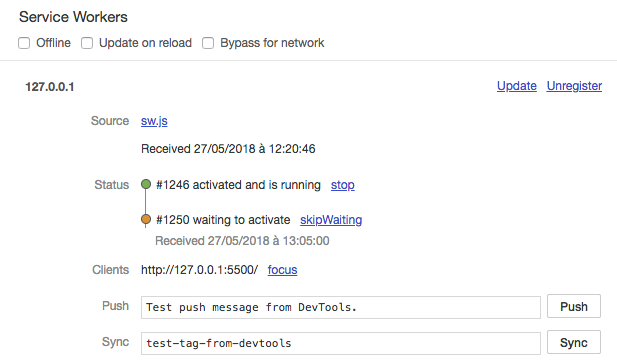

# Step 2 : Install a Service Worker

[Service Worker](https://developers.google.com/web/fundamentals/primers/service-workers/) is a fairly large API with a lot of potential. In the context of a PWA, a Service Worker will mainly allow us to define a caching strategy and thus better manage unstable connections, or even get a complete offline mode for our application.

What you should know about Service Workers:

* They are workers coded in JavaScript. They run in their own thread, separated from the application, and can not access the DOM or global variables. But the app and worker can communicate through the `postMessage` API.
* These can act like programmable network proxies: they can intercept network requests from the browser and customize the responses.
* Their life cycle is independent of the associated web application: they automatically stop when not in use and restart when needed.
* They can work even when the associated web application is not running, allowing some new features like sending push notifications.
* Several APIs are available within the Service Worker to persist data locally, for example the [**Cache API**](https://developer.mozilla.org/en/docs/Web/API/Cache) and the [**IndexedDB API**](https://developer.mozilla.org/en/docs/Web/API/API_IndexedDB).
* Most of the associated APIs use [Promises](https://developer.mozilla.org/en/docs/Web/JavaScript/Reference/Global_Objects/Promise).

In the `app` folder, create a new `sw.js` file. It will contain the code of your Service Worker.

## Registering the Service Worker

Before using a Service Worker, it must be registered by the application. The Service Worker is usually registered when the page is loaded. In the `scripts.js` file, complete the function called when the document is loaded with the following code:

```js
if ('serviceWorker' in navigator) {
  navigator.serviceWorker
    .register('/sw.js')
    .then(serviceWorker => {
      console.log('Service Worker registered: ' + serviceWorker);
    })
    .catch(error => {
      console.log('Error registering the Service Worker: ' + error);
    });
}
```

Reload the page, the following log should appear in the console once the page loaded.

```
Service Worker registered: [object ServiceWorkerRegistration]
```

This means that the Service Worker has been registered. This can be verified by looking in the **Application** tab of Chrome Dev Tools, then the **Service Workers** subsection.


We will see in the following section what happens after registering a Service Worker.

## Service Worker life cycle

When you register a Service Worker, its life cycle starts. The following diagram shows the different stages of a Service Worker's life cycle ([source](https://developers.google.com/web/fundamentals/primers/service-workers/)).


The first steps are installation and activation. Let's check this by adding the following code in the _sw.js_ file.

```js
self.addEventListener('install', event => {
  console.log('Service Worker installing.');
});

self.addEventListener('activate', event => {
  console.log('Service Worker activating.');
});
```

Reload the page and check the logs. Curiously, we only see the installation log.

```
Service Worker registered [object ServiceWorkerRegistration]
Service Worker installing.
```

Let's check what is going on in the Service Worker section of the Dev Tools. You should see something like this:



When you refresh the page, the browser tries to install and activate the Service Worker with the new code. Since the latter is different from the active Service Worker, the one that has been registered at the beginning of step 2, the activation of the new one is suspended. In this case, it is put in a waiting mode and will only be installed if the previous Service Worker does not control any clients. There are two solutions in this case: either close all the tabs controlled by the first Service Worker, or click on the **skipWaiting** link in the dev tools.

Click on the **skipWaiting** link. Notice that the former Service Worker has disappeared and that the one who was waiting took his place. The activation log is also displayed in the console.

```
Service Worker activating.
```

When we refresh the page without modifying the Service Worker, we notice that we no longer go through the installation and activation steps.

This behaviour is necessary to manage version upgrades in production. In practice, you will write code in the Service Worker that manages this update process and call `skipWaiting` programmatically once everything is set up correctly. 

During development, we will keep things simple by ticking the checkbox **Update on reload**. This option will immediately activate future new Service Workers. It's an equivalent of an automatic click on **skipWaiting** each time.

::: tip Note
Enable the **Update on reload** option when working on the code of a Service Worker to always have the latest version. 


However, this option will install and activate the Service Worker **before** displaying the page, so you won't see the logs associated with these events in console.
:::

In this part, we saw how to install a Service Worker, and how to managetwo Service Worker lifecycle events: **install** and **activate**. Now, let's see how to do something useful with this Service Worker.