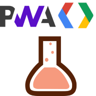

# PWA from scratch workshop

<SuggestLocale></SuggestLocale>

You may have heard about Progressive Web Apps (PWA) in the latest web trends. What is it all about and how do they improve classic web applications ? This workshop will let you understand PWA better with a bit of practice 💪.

We will transform together a classic web application into a PWA. This will enable the user to have a basic offline mode, and to install the app on his smartphone with a shortcut on the homescreen.

## Requirements

- Basic knowledge of HTML, CSS and JavaScript. Understanding Promises and asynchronicity in JS can be a plus.
- A computer with a **code editor** such as [Visual Studio Code](https://code.visualstudio.com/)
- **Google Chrome** (_PWA are supported on most browsers but to facilitate the organization of the workshop, we will all use the same browser during development_)
- A **local web server** (if you don't have any, try [npmjs.com/http-server](http://npmjs.com/http-server) with `cd app && http-server`)

## Preparation

- [Clone or download the example web app](https://github.com/sylvainpolletvillard/pwa-workshop.git) which is located in the [app folder](https://github.com/sylvainpolletvillard/pwa-workshop/tree/master/app) of this repo.
- Open the `app` folder in your code editor.
- Configure your local server to serve the `app` folder.
- Load the `app/index.html` page on Google Chrome. A list of attendees should be displayed.

## Steps of the workshop

1. Add a web application manifest
2. Install and activate a Service Worker
3. Pre-caching of static assets for a basic offline mode
4. Cache/Update/Refresh Strategy for the API GET requests
5. Background sync and examples of push notifications
6. Presenting an install button
