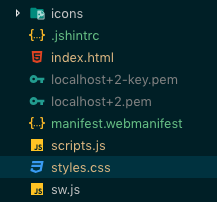
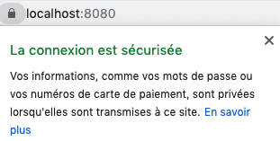

# Etape 2 : Installation d'un Service Worker

Avant de nous lancer dans les Services Workers, regardons d'abord en quoi consiste les Web Worker.

## Introduction aux Web Worker

Comme vous le savez peut-être, JavaScript est à thread unique et ne permet pas la création de nouveaux threads.
Un Web Workers permet d'exécuter du code dans un thread séparé pour une utilisation générale.
Le code du worker réside généralement dans un fichier JavaScript distinct du code JavaScript principal.
Après avoir créé le Web Worker, nous avons deux threads JavaScript: celui du JavaScript principal et celui du Web Worker.
Une fois le worker créé, il peut interagir avec le code JavaScript principal de manière bidirectionnelle à l'aide de la fonction `postMessage` et de l'évènement `message`.

Étant donné que le travailleur Web dispose de son propre thread, il peut effectuer des tâches exigeant beaucoup de processus sans geler la page.

Voici une page Web minimale qui a créé un agent de service et qui communique avec lui.

```html
<!DOCTYPE html>
<html>
<head>
    <meta charset="UTF-8">
    <script src="main.js"></script>
    <title>Web Worker example</title>
</head>
<body>
    <button onclick="sendMessageToWorker()">Post message to worker</button>
    <button onclick="askWorkerToPerformRecurringTask()">Launch recurring task</button>
    <h3>Worker result</h3>
    <div id="result"></div>
</body>
</html>
```

Voici le code qui crée le worker et qui communique avec lui.

```javascript
// crate a worker whose code is defined in the file passed as parameter
const worker = new Worker("worker.js");
function askWorkerToPerformRecurringTask(){
    // post a sting to the worker
    worker.postMessage("recurring");
}
function sendMessageToWorker(){
    // post a sting to the worker
    worker.postMessage("Hello World !");
}
// This event is fired when the worker posts a message
// The value of the message is in messageEvent.data
worker.addEventListener("message", function(messageEvent){
    const div = document.getElementById("result");
    // Log the received message on the top of the tag
    div.innerHTML = messageEvent.data + "<br>" + div.innerHTML;
});
```

Enfin, voici le code du Web Worker qui réagit au message reçu du JS principal en publiant un seul message ou en affichant un nombre aléatoire toutes les secondes.

```javascript
// a function that generates a random number every second and posts it to the main JavaScript
function generateNumbers(){
    setInterval(function(){
        // post a message to the main JavaScript
        self.postMessage(Math.random());
    }, 1000);
}
// This event is fired when the worker recieves a message from the main JavaScript
// The value of the message is in messageEvent.data
self.addEventListener("message", function(messageEvent){
    if(messageEvent.data === "recurring"){
        // If the value of the event is "recurring", we launch the above function
        generateNumbers();
    }else{
        // Post a message back to the main JS
        self.postMessage("Hello to you too !");
    }
});
```

Vous pouvez essayer cette page [en suivant ce lien](https://pwa-workshop.js.org/samples/worker01/)

Ceci conclut cette introduction courte aux Web Workers.

## Ajout d'un Service Worker

Les [Service Workers](https://developers.google.com/web/fundamentals/primers/service-workers/) constituent une API assez vaste et présentant beaucoup de potentiel. Dans le cadre d'une PWA, le Service Worker va principalement nous permettre de définir une stratégie de mise en cache et ainsi mieux gérer les connexions capricieuses, voire un mode offline complet pour notre application.

Ce que vous devez retenir au sujet des Service Workers:

* Ce sont des workers codés en JavaScript. Ils s'éxécutent dans un thread distinct du script applicatif et ne peuvent pas accéder au DOM ni aux variables globales, mais l'application peut communiquer avec le worker grâce à l'API `postMessage`.
* Ils peuvent être considérés comme des proxy réseau programmables. En effet, ils permettent d'intercepter les requêtes réseau en partance du navigateur et de personnaliser les réponses.
* Ils ont un cycle de vie indépendant de l'application web associée. Ils s'arrêtent lorsqu'ils ne sont pas utilisés et redémarrent au besoin.
* Ils peuvent fonctionner sans que l'application web associée tourne, ce qui permet certaines fonctionnalités inédites comme l'envoi de notifications Push.
* Plusieurs API sont disponibles au sein du Service Worker pour persister les données localement, par exemple l'[**API Cache**](https://developer.mozilla.org/fr/docs/Web/API/Cache) et l'[**API IndexedDB**](https://developer.mozilla.org/fr/docs/Web/API/API_IndexedDB).
* La plupart des API associées sont basées sur l'utilisation des promesses ([`Promise`](https://developer.mozilla.org/fr/docs/Web/JavaScript/Reference/Objets_globaux/Promise)).

Dans le dossier `app`, créez un fichier `sw.js` vide (pour l'instant). Il contiendra le code de votre Service Worker.

## Enregistrement du Service Worker

Avant d'utiliser un Service Worker, il faut le faire enregistrer par l'application. On enregistre généralement le Service Worker au chargement de la page. Dans le fichier `scripts.js`, complétez la fonction appelée au chargement du document avec le code suivant :

```js
if ('serviceWorker' in navigator) {
  navigator.serviceWorker
    .register('/sw.js')
    .then(serviceWorker => {
      console.log('Service Worker registered: ' + serviceWorker);
    })
    .catch(error => {
      console.log('Error registering the Service Worker: ' + error);
    });
}
```

Rechargez la page, le log suivant devrait apparaitre une fois la page chargée.

```
Service Worker registered: [object ServiceWorkerRegistration]
```

Cela signifie que le Service Worker a bien été enregistré. On peut vérifier cela en regardant dans l'onglet **Application** des Chrome Developer Tools, puis dans la sous-section **Service Workers**.


Nous allons voir dans le section qui suite ce qui se passe après l'enregistrement d'un Service Worker.

## Cycle de vie du Service Worker

Quand on enregistre un Service Worker, son cycle de vie démarre. Le schéma suivant représente les différentes étapes du cycle de vie d'un Service Worker ([source](https://developers.google.com/web/fundamentals/primers/service-workers/)).


Les premières étapes sont l'installation et l'activation. Vérifions cela en ajoutant le code suivant dans le fichier _sw.js_.

```js
self.addEventListener('install', event => {
  console.log('Service Worker installing.');
});

self.addEventListener('activate', event => {
  console.log('Service Worker activating.');
});
```

Rechargez la page et vérifier les logs. Curieusement, on ne voit que le log d'installation.

```
Service Worker registered [object ServiceWorkerRegistration]
Service Worker installing.
```

Regardons ce qui se passe dans la section Service Worker des Dev Tools. Un affichage similaire à la capture suivante devrait apparaitre:


Quand on rafraîchit la page, le navigateur essaie d'installer puis d'activer le Service Worker avec le nouveau code. Comme ce dernier est différent du Service Worker actif, celui enregistré au début de l'étape 2, l'activation du nouveau Service Worker est suspendue. Dans ce cas, il est mis en attente et ne sera installé que si le précédent Service Worker ne contrôle plus aucun client. On a deux solutions dans ce cas: soit fermer tous les onglets controlés par le premier Service Worker ou bien cliquer sur le lien **skipWaiting** dans les outils développeur.

Cliquez sur le lien **skipWaiting**. On remarque que l'ancien Service Worker a disparu et que celui qui était en attente prend sa place. Le log d'activation s'affiche également.

```
Service Worker activating.
```

Quand on rafraîchit la page sans modifier le Service Worker, on remarque qu'on ne passe plus par les étapes d'installation et d'activation.

Ce comportement est nécessaire pour gérer les montées de version des Service Workers en production. En pratique, vous aurez à écrire du code dans le Service Worker pour gérer ce processus de mise à jour et appeler `skipWaiting` programmatiquement une fois que tout est prêt. 

Pendant le développement toutefois, on peut s'en passer en cochant la case **Update on reload**. Cette option permet d'activer immédiatement les futurs nouveaux Service Workers. C'est un équivalent d'un clic automatique sur **skipWaiting** à chaque fois.

::: tip Note
Activez l'option **Update on reload** lorsque vous travaillez sur le code d'un Service Worker pour toujours disposer de la dernière version.

 

Attention toutefois, cette option installera et activera le Service Worker **avant** d'afficher la page, ce qui ne vous permettra pas de voir les logs associés à ces évènements en console.
:::

## bibliothèque de compatibilité PWA

Comme la technologie Progressive Web Apps est récente et en évolution, certains navigateurs ne supportent pas encore certaines fonctionnalités.
Par exemple, Safari 12 mobile ne prend pas en charge l'écran d’accueil (ou splash-screen).
[pwacomat] (https://github.com/GoogleChromeLabs/pwacompat) de Google Chrome Labs résout ce problème en ajoutant simplement une balise de script dans le fichier html.

```html
<script async src="https://cdn.jsdelivr.net/npm/pwacompat@2.0.8/pwacompat.min.js"
    integrity="sha384-uONtBTCBzHKF84F6XvyC8S0gL8HTkAPeCyBNvfLfsqHh+Kd6s/kaS4BdmNQ5ktp1"
    crossorigin="anonymous"></script>
```

Nous vous recommandons vivement d’ajouter ce script à vos PWA pour une meilleure compatibilité.

## Développement local avec SSL

PWA nécessite l'utilisation de HTTPS. Ce n’est pas problématique pour un PWA déployé car la plupart des hébergeurs supportent HTTPS.
Cependant, ce n'est pas aussi simple pour développement local.
En effet, il faut pour cela générer et installer manuellement des certificats dans le magasin de certificats.
Heureusement, il existe un outil CLI intéressant appelé [mkcert](https://mkcert.dev/) qui simplifie ces étapes.

Configurons notre serveur HTTPS local en procédant comme suit:

* Installer [mkcert](https://github.com/FiloSottile/mkcert#installation) en suivant les instruction indiquées dans le GitHub
* Lancer `mkcert -install` Pour installer une CA (Autorité de certification)

```console
Created a new local CA at "/Users/****/Library/Application Support/mkcert" 💥
The local CA is now installed in the system trust store! ⚡️
The local CA is now installed in the Firefox trust store (requires browser restart)! 🦊
```

* cd jusqu'à la racine du site
* Lancer cette commande qui génère les certificats pour notre serveur de dev: `mkcert localhost 127.0.0.1 ::1`

```console
Using the local CA at "/Users/****yassinebenabbas****/Library/Application Support/mkcert" ✨

Created a new certificate valid for the following names 📜
 - "localhost"
 - "127.0.0.1"
 - "::1"

The certificate is at "./localhost+2.pem" and the key at "./localhost+2-key.pem" ✅
```

* Nous aurons deux fichiers PEM. Ceux-ci seront utilisés par notre serveur de développement compatible SSL.



* Installer la commande `http-server`. `npm i -g http-server`
* Lancer le serveur en mode SSL `http-server -S -o -C "localhost+2.pem" -K "localhost+2-key.pem"`

Et voilà, on est bien en HTTPs en local. C'est le top !



Dans cette partie, nous avons vu comment installer un Service Worker. 
On a également géré deux évènements du cycle de vie du Service Worker: **install** et **activate**. Nous allons maintenant voir comment faire quelque-chose d'utile avec ce Service Worker.