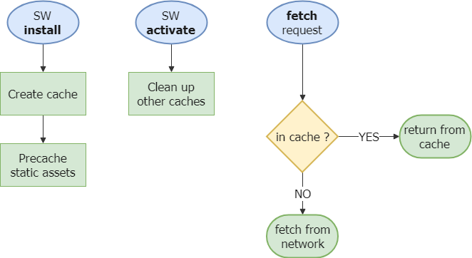
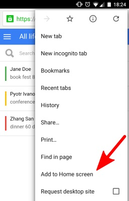

# Etape 3 : Precaching des assets statiques pour un mode offline basique

On a vu dans l'étape précédent deux méthodes du cycle de vie d'un Service Worker: `install` et `activate`. Dans cette partie, on va poursuivre notre exploration des PWA en mettant en cache les fichiers statiques.

## Préambule: Utilisation des promesses et async / wait

Les API de Service Worker reposent largement sur des promesses. Jetons un coup d'œil sur leur fonctionnement.

::: tip
Vous pouvez essayer le code de cette section en utilisant node ou un éditeur en ligne tel que [https://repl.it](https://repl.it/languages/nodejs)
:::

Les promesses sont une interface standardisée permettant de mieux gérer un enchaînement de fonctions asynchrones. Elles améliorent la lisibilité du code et sont plus pratiques à manipuler par le développeur que des fonctions de retour (_callbacks_) passées en argument par exemple. La norme ES2015 de JavaScript permet de créer des promesses à l'aide de ce constructeur:

```javascript
const promise = new Promise((resolve, reject) => {
  // async function execution
  // resolve is called on success
  // reject is called on failure
});
```

Voici un exemple plus concret d’une `Promise` qui génère un nombre aléatoire après un délai de 1 seconde. Il réussit lorsque le nombre généré est pair et échoue lorsque le nombre généré est impair.

```javascript
function generateRandomNumber() {
  return new Promise(function(resolve, reject) {
    setTimeout(function() {
      const nb = Math.floor(Math.random() * 10); // random number between 0 and 10
      if (nb % 2 == 0) {
        resolve(nb);
      } else {
        reject({ message: "odd number", number: nb });
      }
    }, 1000);
  });
}
```

Toutefois, nous n'utiliserons pas ce constructeur `Promise` car la plupart des API liées au Service Worker sont des fonctions qui renvoient déjà une `Promise`.

Une fois que nous avons un objet de type `Promise`, le code associé commence à s'exécuter de manière asynchrone. Nous pouvons utiliser par la suite les fonctions `then()` et `catch()` pour exécuter une fonction lorsque la `Promise` réussit (elle a appelé `resolve`) ou échoue (elle a appelé `reject`).

L'exemple suivant montre comment gérer la promesse renvoyée par la fonction `generateRandomNumber ()`. [Exécuter en ligne](https://repl.it/@yostane/promise01)

```javascript
const promise = generateRandomNumber(); // create a promise that generated a random number asynchronously
promise
  .then(function(number) {
    // this function is called when the promise succeds
    console.log(number);
  })
  .catch(function(error) {
    // this function is called when the promise fails
    console.error(error);
  });
console.log("Promise example"); // this message is shows first because the promise is async
```

Nous pouvons rendre le code un peu plus lisible en passant des fonctions à `then` et `catch` au lieu de définir des fonctions anonymes. [Exécuter en ligne](https://repl.it/@yostane/promise02)

```javascript
function handleSuccess(number) {
  console.log(number);
}
function handleFailure(message) {
  console.error(message);
}
generateRandomNumber()
  .then(handleSuccess)
  .catch(handleFailure);
console.log("Promise example"); // this message is shows first because the promise is async
```

L'intérêt principal des promesses est qu'elles peuvent être facilement chaînées. L'exemple suivant génère un nouveau nombre aléatoire de manière asynchrone seulement si la première `Promise` réussit. [Exécuter en ligne](https://repl.it/@yostane/promise03)

```javascript
function handleSuccess(number) {
  console.log(number);
}
function handleFailure(message) {
  console.error(message);
}
generateRandomNumber()
  .then(handleSuccess)
  .then(generateRandomNumber)
  .then(handleSuccess) // chain a second promise and handle is result
  .catch(handleFailure); // if any of the previous calls fails, catch is called
console.log("Promise example"); // this message is shows first because the promise is async
```

Depuis la spécification ES2018, il existe un nouvel opérateur permettant de gérer les promesses dans un style plus _synchrone_.
Au lieu d'enchainer les appels de `then`, on peut mettre en pause l'exécution d'une fonction en attendant le résultat d'une promesse, puis stocker ce résultat dans une variable et reprendre l'exécution de la fonction.

Ceci est appelé _une attente du résultat_ ou **await** et se fait en utilisant les mots-clés `async / await`. Avec cette méthode, la méthode `catch` est remplacée par un bloc `try / catch`, tout comme on gère habituellement les exceptions synchrones.

L'extrait de code suivant transforme le dernier exemple en utilisant `async / wait`. [Exécuter en ligne](https://repl.it/@yostane/promise04)

```javascript
// If we want to use await, we must be place the code in async function
// More reading https://github.com/tc39/proposal-top-level-await, https://gist.github.com/Rich-Harris/0b6f317657f5167663b493c722647221
async function mainAsync() {
  try {
    // create the promise asynchronously without blocking the thread
    // and wait for its result (the parameter passed to resolve)
    const nb1 = await generateRandomNumberAsync();
    console.log(nb1); // nb1 is not the promise but rather its result in case of success
    const nb2 = await generateRandomNumberAsync();
    console.log(nb2);
  } catch (error) {
    // this catch block is executed if any promise above fails
    console.error(error); // the error variable is the value passed to reject
  }
}
mainAsync(); // call the function that runs async code
console.log("Promise example with async / await");
```

Ceci conclut cet aperçu sur les promesses et async/wait.
Avec cette connaissance acquise, nous pouvons utiliser les API de mise en cache du service worker plus sereinement.

_Voici en bonus quelques exercices supplémentaires: [série 1](https://github.com/asakusuma/promise-workshop), [série 2](https://repl.it/@AdamCahan/Promise-practice-exercises) et [série 3](https://developers.google.com/web/ilt/pwa/lab-promises)_

## Découverte des API de mise en cache

Parmi les [API auquel a accès le Service Worker](https://developer.mozilla.org/en-US/docs/Web/API/Service_Worker_API), celle qui nous intéresse le plus est [l'API Cache](https://developer.mozilla.org/en-US/docs/Web/API/Cache). En effet, elle permet de mettre dans un cache persistant les paires Requêtes/Réponses réseau via la méthode `cache.put(request, response)`. Il est également possible de passer une ou plusieurs URL en argument des méthodes `add` et `addAll` ; elles seront requêtées et la réponse sera ajoutée au cache. On peut également supprimer des entrées du cache avec la méthode `delete`.

Les différents caches sont accessibles via la variable `caches` depuis le Service Worker. C'est l'API [CacheStorage](https://developer.mozilla.org/en-US/docs/Web/API/CacheStorage) qui permet, entre autres, de créer/obtenir un objet cache ou d'en supprimer un avec les fonctions `open` et `delete`.

Enfin, une autre méthode intéressante du cache est `match`: elle vérifie dans les tous les objets `Cache` gérés par le `CacheStorage` si une requête est identique à celle passée en paramètre. Si c'est le cas, elle retourne un promesse qui permet d'accéder à la réponse en cache.

## Ajout des fichiers statiques dans le cache

Nous allons mettre en cache les fichiers statiques essentiels de l'application, et ce le plus tôt possible. Le moment opportun pour cela est l'évènement `install` du Service Worker, car il n'est appelé qu'une fois lors de son installation. C'est ce qu'on appelle le _precaching_.

1. Placez-vous dans `sw.js` dans le callback de l'événement `install` vu à l'étape 2.
2. Ouvrez le cache avec [`caches.open('V1')`](https://developer.mozilla.org/en-US/docs/Web/API/CacheStorage/open), qui retourne une promesse résolue avec l'objet `cache`. Le numéro de version dans le nom du cache nous sera utile pour les mises à jour ultérieures.
3. Une fois le cache ouvert, ajoutez au cache avec [`cache.addAll(['url1','url2',...])`](https://developer.mozilla.org/en-US/docs/Web/API/Cache/addAll) les URL vers les fichiers statiques essentiels de notre application: la page HTML racine, le fichier `styles.css` et le fichier `scripts.js`.
4. Afin que le Service Worker s'active une fois le precaching terminé, passez la `Promise` retournée par `cache.addAll` en argument à [`event.waitUntil()`](https://developer.mozilla.org/en-US/docs/Web/API/ExtendableEvent/waitUntil), `event` étant l'évènement d'installation.

<Solution>

```js
const CACHE_NAME = "V1";
const STATIC_CACHE_URLS = ["/", "styles.css", "scripts.js"];

self.addEventListener("install", event => {
  console.log("Service Worker installing.");
  event.waitUntil(
    caches.open(CACHE_NAME).then(cache => cache.addAll(STATIC_CACHE_URLS))
  );
});
```

</Solution>

Rechargez la page et le Service Worker, en vérifiant bien que la nouvelle version du Service Worker remplace l'ancienne comme vu à l'étape 2. On peut alors vérifier que les fichiers sont ajoutés dans le cache en consultant l'écran _Cache Storage_ de l'onglet _Application_ des Developer Tools.


## Réponse avec le cache en priorité

Maintenant que les fichiers sont en cache, il nous reste à indiquer d'utiliser leur version en cache lorsque le navigateur les demande. Pour ce faire, nous allons passer par l'évènement `fetch`. Ce dernier intercepte tous les appels émis par les clients ayant installé le Service Worker. On peut alors retourner une réponse personnalisée avec `event.respondWith`, où `event` est le [FetchEvent](https://developer.mozilla.org/en-US/docs/Web/API/FetchEvent). La fonction [`event.respondWith`](https://developer.mozilla.org/en-US/docs/Web/API/FetchEvent/respondWith) prend comme unique argument une promesse qui devra être résolue avec la réponse à retourner.

```js
self.addEventListener("fetch", event => {
  console.log(`Request of ${event.request.url}`);

  // comportement par défaut: requête le réseau
  event.respondWith(fetch(event.request));
});
```

Nous voulons changer le comportement par défaut et retourner les versions préalablement mises en cache si elles existent. Justement, la fonction [`caches.match`](https://developer.mozilla.org/en-US/docs/Web/API/CacheStorage/match) retourne une promesse résolue avec un objet `Response`, tout comme `fetch(event.request)`. On peut donc remplacer l'un par l'autre pour retourner les fichiers statiques en cache au lieu d'aller les chercher sur le réseau.

1. Ajoutez un callback pour l'événement `fetch`, de la même façon que vous l'avez fait pour `install` à l'étape précédente.
2. Appelez la méthode `caches.match(event.request)` pour chercher dans le cache une éventuelle réponse mise en cache pour la requête correspondante.
3. Si aucune entrée dans le cache n'est trouvée, la promesse est résolue avec la valeur `undefined`. Dans ce cas, il faut requêter le réseau et retourner `fetch(event.request)` à la place.
4. Il ne reste plus qu'à retourner cette promesse de réponse à la requête en la passant en argument à `event.respondWith()`

<Solution>
```js
self.addEventListener('fetch', event => {
  // Stratégie Cache-First
  event.respondWith(
    caches.match(event.request) // On vérifie si la requête a déjà été mise en cache
    .then(cached => cached || fetch(event.request)) // sinon on requête le réseau
  );
});
```
</Solution>

## Test de fonctionnement offline

Si tout a été fait correctement, vous devriez désormais pouvoir tester l'application en mode offline. Coupez votre serveur local et essayez de recharger l'application. La page en cache devrait alors s'afficher.

## Mise à jour du cache statique

La mise en cache des fichiers statiques pose un problème; que se passe-t-il si j'ajoute, supprime, ou modifie ces fichiers sur le serveur ?

Tel que nous avons codé actuellement notre Service Worker, on rechargera toujours les fichiers en cache, donc les nouvelles versions déployées sur le serveur ne seront jamais utilisées.

Pour gérer ce problème, une solution est de passer par un nouveau cache avec un autre nom. L'idée ici serait de créer un nouveau cache **V2** qui contient les nouveaux fichiers et de supprimer l'ancien cache.



1. Dans le callback de l'événement `install`, changez le nom du cache en `V2`
2. Dans le callback de l'événement `activate`, supprimez l'ancien cache avec `caches.delete('V1')`
3. Passez la `Promise` retournée par `caches.delete` dans `event.waitUntil` afin d'attendre la suppression du cache avant la fin de l'étape d'activation
4. _(facultatif)_ - Améliorez votre code de nettoyage des anciens caches en supprimant tous les caches qui ne font pas partie de votre liste de caches connus et utilisés. Vous pouvez parcourir tous les caches existants avec la méthode `caches.keys()`

<Solution>

```js
const CACHE_NAME = "V2";

self.addEventListener("activate", event => {
  // delete any unexpected caches
  event.waitUntil(
    caches
      .keys()
      .then(keys => keys.filter(key => key !== CACHE_NAME))
      .then(keys =>
        Promise.all(
          keys.map(key => {
            console.log(`Deleting cache ${key}`);
            return caches.delete(key);
          })
        )
      )
  );
});
```

</Solution>

## Installation de la PWA

Selon le navigateur et l'OS, les conditions techniques requises pour pouvoir installer la PWA sur le système varient. Mais en principe, si vous avez un manifeste et un Service Worker actif gérant les requêtes entrantes avec `fetch`, alors vous pouvez actuellement installer cette PWA sur toutes les plates-formes supportées, et elles mettront à profit le manifeste et le Service Worker.

La plate-forme ayant la meilleure intégration ce jour est **Android**. Si vous disposez d'un smartphone Android pouvant requêter votre serveur suite à un partage de connexion, essayez de charger l'application via Chrome for Android. Une fois la page web ouverte, le menu de Chrome devrait comporter l'option: **Add to home screen**



Poursuivre l'installation. Un nouveau raccourci devrait apparaitre dans l'écran d'accueil du smartphone. C'est le raccourci vers notre PWA !


Une fois la PWA installée, quand on clique sur le raccourci, un splash screen est affiché brièvement. Celui-ci reprend les couleurs et l'icône spécifiée dans le manifeste.

Vous remarquerez que la barre d'adresse et le reste de l'interface du navigateur ne sont plus présentes, si vous avez configuré la propriété `display` en `standalone` dans le manifeste.


```

```
