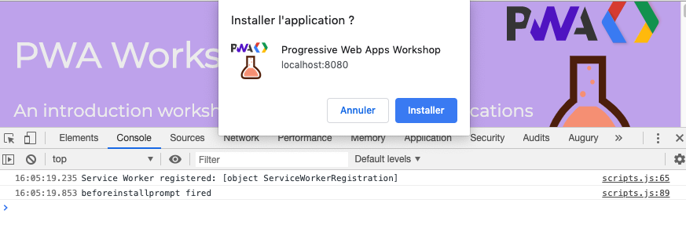

# Etape 5 : Installation de la PWA sur le système

## Introduction

Un des avantages des PWA est qu’ils peuvent être installés s’ils respectent certains critères. Ce derniers dépendent du navigateur utilisé. Voici, à titre d'exemple, les critères de [Chrome](https://developers.google.com/web/fundamentals/app-install-banners/#criteria):

- L'application Web n'est pas déjà installée.
  - et `prefer_related_applications` vaut `false`.
- Rencontre une heuristique d'engagement de l'utilisateur (actuellement, l'utilisateur a interagi avec le domaine pendant au moins 30 secondes)
- Comprend un manifeste d'applications Web comprenant:
  - `short_name` ou `name`
  - les icônes doivent inclure des icônes de 192px et 512px
  - `start_url`
  - l'affichage doit être l'un des suivants: `fullscreen`, `standalone` ou `minimal-ui`
- Servi sur HTTPS (obligatoire pour les agents de service)
- A inscrit un technicien de service avec un gestionnaire d'événements fetch

À l'origine, le navigateur gérait toutes les étapes liées à l'installation, de la présentation de la bannière à l'ajout de l'icône de l'application à l'écran d'accueil. Cependant, il est maintenant possible de gérer en partie la présentation de l'interface utilisateur menant à l'invite d'installation de la PWA. Dans ce cas, le navigateur détermine s'il convient d'afficher ce bouton et en informe l'application par le biais de l'évènement `beforeinstallprompt`.

L'application doit vérifier si elle peut présenter une interface utilisateur de configuration en écoutant cet événement et en demandant au navigateur d'afficher l'invite d'installation. Le navigateur se charge ensuite du déroulement de l'installation. L'application peut cependant savoir si l'utilisateur a validé l'invite et si l'installation s'set achevée avec succès.

## Installation de la PWA

Selon le navigateur et l'OS, les conditions techniques requises pour pouvoir installer la PWA sur le système varient. Mais en principe, si vous avez un manifeste et un Service Worker actif gérant les requêtes entrantes avec `fetch`, alors vous devriez pouvoir actuellement installer cette PWA sur toutes les plates-formes supportées, et elles mettront à profit le manifeste et le Service Worker.

La plate-forme ayant la meilleure intégration ce jour est **Android**. Si vous disposez d'un smartphone Android pouvant requêter votre serveur suite à un partage de connexion, essayez de charger l'application via Chrome for Android. Une fois la page web ouverte, le menu de Chrome devrait comporter l'option: **Add to home screen**


Poursuivre l'installation. Un nouveau raccourci devrait apparaitre dans l'écran d'accueil du smartphone. C'est le raccourci vers notre PWA !


Une fois la PWA installée, quand on clique sur le raccourci, un splash screen est affiché brièvement. Celui-ci reprend les couleurs et l'icône spécifiée dans le manifeste.

Vous remarquerez que la barre d'adresse et le reste de l'interface du navigateur ne sont plus présentes, si vous avez configuré la propriété `display` en `standalone` dans le manifeste.


## Ajout d'un invité d'installation

Ajoutons un **Bouton d'installation** à notre PWA en procédant comme suit:

- Définissez la propriété [prefer_related_applications](https://developers.google.com/web/fundamentals/app-install-banners/native#prefer_related_applications) sur `false` dans le fichier manifeste.

```json
{
  "prefer_related_applications": false
}
```

- Ajouter un bouton masqué par défaut et qui servira à afficher l'invite.

```html
<button id="setup_button" onclick="installApp()">Installer</button>
```

```css
#setup_button {
  display: none;
}
```

- Dans le JavaScript principal, intercepter l'évènement `beforeinstallprompt` qui est déclenché lorsque la PWA satisfait les critères d'installation. Dans le gestionnaire de l'évènement, on gardera une référence vers son paramètre et on affichera le bouton d'installation.

```js
let deferredPrompt; // Allows to show the install prompt
let setupButton;

window.addEventListener("beforeinstallprompt", e => {
  // Prevent Chrome 67 and earlier from automatically showing the prompt
  e.preventDefault();
  // Stash the event so it can be triggered later.
  deferredPrompt = e;
  console.log("beforeinstallprompt fired");
  if (setupButton == undefined) {
    setupButton = document.getElementById("setup_button");
  }
  // Show the setup button
  setupButton.style.display = "inline";
  setupButton.disabled = false;
});
```

- La fonction `installApp()` qui est lancée suite au clic sur le bouton, affiche l'invite d'installation en utilisant la référence récupérée dans le `beforeinstallprompt`.

```js
function installApp() {
  // Show the prompt
  deferredPrompt.prompt();
  setupButton.disabled = true;
  // Wait for the user to respond to the prompt
  deferredPrompt.userChoice.then(choiceResult => {
    if (choiceResult.outcome === "accepted") {
      console.log("PWA setup accepted");
      // hide our user interface that shows our A2HS button
      setupButton.style.display = "none";
    } else {
      console.log("PWA setup rejected");
    }
    deferredPrompt = null;
  });
}
```

- Optionnellement, on peut être avertis de la fin de l'installation.

```js
window.addEventListener("appinstalled", evt => {
  console.log("appinstalled fired", evt);
});
```

Il est maintenant temps de tester !. N'hésitez pas à forcer un nettoyage du cache.




La PWA lancée en mode standalone sur macOS ressemble à cela:


